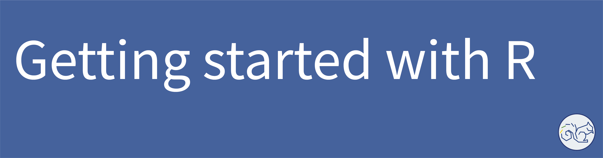

In the past decade or so, we've been hearing more and more about data, everywhere from our academic and professional lives to our personal lives. Data is an unavoidable and inescapable aspect of our lives, especially as those lives unfold, increasingly, online. These considerations may feel overwhelming on the surface, but, rather than fear or fight data itself, we can be empowered through the use of powerful, open source tools created to help us get a handle on the data we inevitably collect in order to use it in meaningful and equitable ways. R is one of these tools; it is a powerful programming language and environment in which users can arrange and analyze data through statistical computing. 

While R and its development environment, RStudio, are free to access and use, there's a not insignificant learning curve to overcome in order to understand and use it efficiently for your own work and research. Forunately, that's what Geneseo's [Center for Digital Learning](https://www.geneseo.edu/cdl) is here for!

In this workshop, you'll learn about

1. [Importing data (CSV, XLSX)](sections/01-importing-data.md)
2. [Validating data structure](sections/02-validating-data.md)
3. Renaming & recoding variables
4. Merging, filtering & aggregating data
5. Visualization techniques

In addition to content added by CDL [Faculty Affiliate](https://www.geneseo.edu/cdl/faculty-affiliates) Matt Pastizzo and other [attributed contributors](#acknowledgements), this workshop at SUNY Geneseo incorporates [content](https://github.com/DHRI-Curriculum/r) shared openly by the [Digital Humanities Research Institute](https://www.dhinstitutes.org/) at the CUNY Graduate Center. A few modifications have been made to tailor the content to our Geneseo community.

## Setting ourselves up

To prepare for the workshop, we recommend installing both R and R Studio.

[Step-by-step video](video1)

1. Download & Install R (base package)
    - Download: [Windows](https://cran.r-project.org/bin/windows/base/) | [Mac](https://cran.r-project.org/bin/macosx/)
    - Run: Windows (`.exe` file) | Mac (`.pkg` )

2. Download & Install R Studio
    - [Windows/Mac](https://rstudio.com/products/rstudio/download/#download)

3. Install necessary packages ([Step-by-step video](video2))
    - Via Command-Line
    - Via RStudio

4. Download [CSV](file1) and [XLSX](file2) files to use during workshop

## Lessons

## Acknowledgements

- Current author: Matt Pastizzo, Ph.D., Department of Psychology, SUNY Geneseo
- Contributing editor: Amanda Wentworth
- Contributing editor: Paul Schacht

---

Getting Started With R by [The Center for Digital Learning at SUNY Geneseo](https://www.geneseo.edu/cdl) is licensed under a [Creative Commons Attribution-ShareAlike 4.0 International License](http://creativecommons.org/licenses/by-sa/4.0/). When sharing this material or derivative works, preserve this paragraph, changing only the title of the derivative work, or provide comparable attribution.

